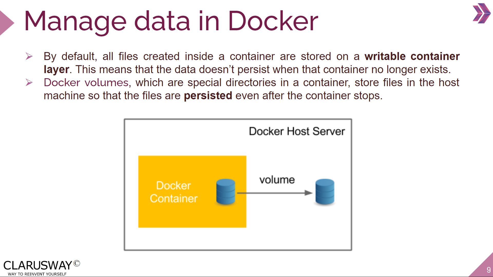

<center></center>
<br>

<center><h1> Django Class Notes</h1></center>
<p>Clarusway</p>
<br>


# Docker for Developers

### Nice to have VSCode Extentions:
- Djaneiro - Django Snippets
- Docker
- project-tree
- hadolint

### Needs
- Python
- pip
- Docker Desktop
- Docker Hub account

## Summary
- What is Docker?
  - Docker Desktop
  - Basic Docker Commands
- Docker Hub
- Folder SetUp
- Dockerize Django
  - .dockerignore
  - Build
  - Share
  - Run
- Dockerize React
- Docker Compose
  - Preperation
  - docker-compose file
  - Build
  - Cleanup
- (Optional) Nginx
- Docker Best practices

<br>

## What is Docker?

A fundamental question for developers: 'The project is working on my computer, but what about my colleague's computer or after deployment to the cloud?'

Docker makes development efficient and predictable. Docker takes away repetitive configuration tasks and is used throughout the development lifecycle for fast, easy and portable application development.

- Docker makes containers.
- Containers are like virtual machines or instances. But, containers can share system resources, unlike VMs.
- One process per Docker container!


- **Build**

Get a head start on your coding by leveraging Docker images to efficiently develop your own unique applications on any OS.

The docker build command builds Docker images from a `Dockerfile` and a `context`. A build's context is the set of files located in the specified PATH or URL . The build process can refer to any of the files in the context. For example, your build can use a COPY instruction to reference a file in the context.

Create your multi-container application using Docker Compose.

- **Share**

You can get Docker Trusted Content, including Docker Official Images and images from Docker Verified Publishers from the Docker Hub repository.

Also, the easiest way to share a Docker image is to push it up to a Docker registry. This functionality is fully integrated into the Docker CLI. You don't need to make any manual file transfers when using this method. The default registry is Docker Hub.

Collaborating with team members and other developers are easy by publishing images to Docker Hub.

- **Run**


Deliver multiple applications hassle free and have them run the same way on all your environments including design, testing, staging and production – desktop or cloud-native.

Deploy your applications in separate containers independently and in different languages. Reduce the risk of conflict between languages, libraries or frameworks.

### Docker Desktop

[Docker Desktop](https://docs.docker.com/desktop/) is an easy-to-install application for your Mac, Linux, or Windows environment that enables you to build and share containerized applications and microservices.

- Open Docker Desktop to work on Docker. See the features.

### Basic Docker Commands

We do not have to memorize Docker commands. Here is a simple [cheat sheet](https://docs.docker.com/get-started/docker_cheatsheet.pdf).

For detailed command options, visit the [Docker CLI guide](https://docs.docker.com/engine/reference/commandline/cli/). 

## Docker Hub

[Docker Hub](https://www.docker.com/products/docker-hub/#:~:text=Docker%20Hub%20is%20a%20hosted,push%20them%20to%20Docker%20Hub) is the world’s largest repository of container images with an array of content sources including container community developers, open source projects and independent software vendors (ISV) building and distributing their code in containers. Users get access to free public repositories for storing and sharing images or can choose subscription plan for private repos.

Docker Hub is a hosted repository service provided by Docker for finding and sharing container images with your team.

Key features include:
- Private Repositories: Push and pull container images.
- Automated Builds: Automatically build container images from GitHub and Bitbucket and push them to Docker Hub.
- Teams & Organizations: Manage access to private repositories.
- Official Images: Pull and use container images provided by Docker.
- Publisher Images: Pull and use container images provided by external vendors. Certified images also include support and guarantee compatibility with Docker Enterprise.
- Webhooks: Trigger actions after a successful push to a repository to integrate Docker Hub with other services.

## Folder SetUp

- Create a working directory named `project`. Create two folders; api/ and client/. Put your Django project inside api/ folder, and React project inside client/ folder.

- The project folder structure will be like;
```
project
├─ api
│  ├─ account
│  ├─ main
│  ├─ manage.py
│  ├─ requirements.txt
│  └─ stock
└─ client
    ├─ package.json
    ├─ public
    ├─ src
    └─ yarn.lock
```

## Dockerize Django

- Before coding, push your initial setup to Github.

- There is no need to create a virtual environment. The Docker container is a self contained, one purpose tool which just have enough resources to run our code.

- See the [Dockerfile reference](https://docs.docker.com/engine/reference/builder/).

- Docker operations are generally three stages. 
  - Build image from a Dockerfile,
  - Push image to registry for future uses,
  - Run image to create container.

- Let's dockerize our Django project.

- Go to api/ folder.

- As a first step and a best practice, create a `.dockerignore` file under api/ folder. This file will be on the same level with the `Dockerfile` we will create on next step. A standard .dockerignore file for Django applications amay be;
```
*.pyc
*.pyo
*.mo
*.db
*.css.map
*.egg-info
*.sql.gz
.cache
.project
.idea
.pydevproject
.idea/workspace.xml
.DS_Store
.git/
.sass-cache
.vagrant/
__pycache__
dist
docs
env/
venv/
logs
src/{{ project_name }}/settings/local.py
src/node_modules
web/media
web/static/CACHE
stats
Dockerfile
.dockerignore
.gitignore
```

### Build

- Create a file named `Dockerfile` under api/ folder;
```dockerfile
# Select a base image which suits your usecase
# Consider using smallest image possible. But there
# are other considerations like security and packages.
FROM python:3.10.8-slim-bullseye

# PYTHONDONTWRITEBYTECODE=1 env prevents Python from copying pyc files 
# to the container. 
ENV PYTHONDONTWRITEBYTECODE=1

# PYTHONUNBUFFERED=1 ensures that Python output is logged to 
# the terminal, making it possible to monitor Django logs in 
# realtime.
ENV PYTHONUNBUFFERED=1

WORKDIR /code

# Docker checks if layers can be reused, if it finds that there are 
# no changes to the requirements.txt file, it will jump straight 
# to the COPY instruction, which will be resolved in a matter of seconds. 
# With this tiny change, we speed up a lot the build process: No more 
# waiting for minutes between builds each time that we modify something 
# in our code.
COPY requirements.txt /code/requirements.txt

# Adding --no-cache-dir to the pip install command saves an 
# additional disk space, as this prevents pip from caching 
# downloads and caching wheels locally. Since you won't need 
# to install requirements again after the Docker image has 
# been created, this can be added to the pip install command.
RUN pip install -r requirements.txt --no-cache-dir

# Copy all the working directory to the container. Optionally a
# `.dockerignore` file can be used not to copy unrelated things
# to the continer and keep it smaller in size and less vulnerable.
COPY . /code

CMD [ "python", "manage.py", "runserver", "0.0.0.0:8000" ]
```

- Open Docker Desktop tool before executing any docker operation. This tool is using Docker deamon and having a nice user interface enables us to do our task easily.

- Build image using Dockerfile on the current directory;
```docker
docker build -t django-backend .
```

- See your image using terminal command;
```
docker images

REPOSITORY       TAG       IMAGE ID       CREATED              SIZE
django-backend   latest    7430248bff0b   About a minute ago   190MB
```

- Also, we can see the details of this image ( Like id sha, tags, environment variables, OS configuration, volumes etc. ) with the command;
```
docker inspect <image id>
```

- This list showing name of the image, image tag, id, created time, and size.

- Alternatively you can open Docker Desktop and see your image under images section.

- To delete an image;
```
docker image rm <image name/id>
```

### Share

- To see how to manage Docker Hub repos see [documentation](https://docs.docker.com/docker-hub/repos/).

- To push an image to Docker Hub first login Docker Hub using your terminal;
```docker
docker login
```

- The prompt will ask for username and password of your Docker Hub account. Enter them correctly.

- The standard format of our image is `docker push <hub-user>/<repo-name>:<tag>`. So we have to tag our current image.
```docker
# docker tag SOURCE_IMAGE[:TAG] TARGET_IMAGE[:TAG]
docker tag django-backend stefanorafe/django-backend:v0.1
```

- Ready to push our image;
```docker
docker push stefanorafe/django-backend:v0.1
```

### Run

- Make a container from the image you just created with the tag `django-backend`;
```docker
docker run -d -p 8000:8000 django-backend

docker run --name django_container -d -p 8000:8000 django-backend

docker run --env-file=.env -d -p 8000:8000 django-backend

docker run -v $PWD/logs:/code/api/logs -d -p 8000:8000 django-backend
```

- The commands above includes `-p` flag which is used for port mapping.


- Creating a volume in Docker enables us to keep data, such as logs or database entries, even after the container is stopped/deleted. In our example above, we are connecting local logs/ folder with the logs/ folder inside container. So, every new container will get the initial log file from local and continue to add the latest log. This will provide data persistence. Be careful writing the paths to your files.



- Go to the Docker Desktop and open your app on the browser. Also you can simply go to the endpoint you published on your docker run command which is port 8000.

- See your application up and running. But if you test the app you will see you did not apply migrations and create db tables. So open a terminal and migrate db tables.

- First see the container list;
```
docker ps
docker ps -a

CONTAINER ID   IMAGE            COMMAND                  CREATED         STATUS         PORTS                    NAMES
37b5afe65eaa   django-backend   "python manage.py ru…"   7 minutes ago   Up 7 minutes   0.0.0.0:8000->8000/tcp   nervous_dhawan
```

- Note the container id. To open a terminal inside container;
```
docker exec [OPTIONS] CONTAINER COMMAND [ARG...]
docker exec -it <container_id> sh
docker exec -it 37b5afe65eaa sh
```

- Then you can execute commands on the terminal opened.

- To delete a container;
```
docker rm <container name/id>
```

## Dockerize React

- Change directory to client/.

- Create the `.dockerignore` file under client/. An example for React project may be;
```
node_modules/
npm-debug.log
Dockerfile
.dockerignore
.git/
build/
env/
venv/
```

- Create Dockerfile for our front-end under client/ folder;
```dockerfile
FROM node:19-slim
WORKDIR /code
COPY package.json /code/package.json

# COPY yarn.lock /code/yarn.lock ?????

# --loglevel verbose flag should output the logs in real time 
# and also save your log into npm-debug.log file.
RUN npm install

COPY . /code

CMD [ "npm", "start" ]
```

- Build image using Dockerfile on the current directory;
```docker
docker build -t react-frontend .
```

- Make a container from the image you just created with the tag `react-frontend`;
```docker
docker run -d -p 3000:3000 react-frontend
docker run --name react -d -p 3000:3000 react-frontend
```

- Test frontend and backend manually. 

## Docker Compose

- Compose is a tool for defining and running multi-container Docker applications. With Compose, you use a YAML file to configure your application’s services. Then, with a single command, you create and start all the services from your configuration.

Compose works in all environments: production, staging, development, testing, as well as CI workflows. It also has commands for managing the whole lifecycle of your application:

  - Start, stop, and rebuild services,
  - View the status of running services,
  - Stream the log output of running services,
  - Run a one-off command on a service.

- The key features of Compose that make it effective are:

  - Have multiple isolated environments on a single host,
  - Preserves volume data when containers are created,
  - Only recreate containers that have changed,
  - Supports variables and moving a composition between environments.

- Compose specification concepts with a concrete example application is in the [documentation](https://docs.docker.com/compose/compose-file/#illustrative-example).

### Preperation

- Remove CMD line from Django Dockerfile. We will handle that command with docker-compose.yml using gunicorn. Gunicorn ‘Green Unicorn’ is a Python WSGI HTTP Server for UNIX. Add [gunicorn](https://pypi.org/project/gunicorn/) (gunicorn==20.1.0) to requirements.txt under api/.

- Also add [psycopg2-binary](https://pypi.org/project/psycopg2-binary/) (psycopg2-binary==2.9.5) to requirements.txt under api/.

- Since our frontend and backend speaks different languages, we need to add Cross-Origin Resource Sharing (CORS) to our code. Make necessary [CORS settings](https://pypi.org/project/django-cors-headers/) on backend.

- Open client/src/context/AuthContext.js, and change const url to "http://0.0.0.0:8000/". Do the same thing for client/src/context/StockContext.jsx. This will ensure frontend communicate with backend exposing port 8000 on localhost.

- First try to integrate with DEV environment. Then, change db to postgres.

- Define db as postgres on your Django app. Sample setting may be;
```py
DATABASES = {
    "default": {
        "ENGINE": "django.db.backends.postgresql",
        "NAME": config("POSTGRES_NAME"),
        "USER": config("POSTGRES_USER"),
        "PASSWORD": config("POSTGRES_PASSWORD"),
        "HOST": config("POSTGRES_HOST"),
        "PORT": config("POSTGRES_PORT"),
        "ATOMIC_REQUESTS": True,
    }
}
```

- Change .env file to include postgres secrets;
```
SECRET_KEY=django-insecure-%s0ghghfdsomestoogd53847
POSTGRES_NAME=postgres
POSTGRES_USER=postgres
POSTGRES_PASSWORD=postgres
POSTGRES_HOST=db
POSTGRES_PORT=5432
DJANGO_LOG_LEVEL=DEBUG
ENV_NAME=DEV
```

- Be sure you defined a STATIC_ROOT variable on the settings.py of the Django project.

- Make sure your Django endpoints comply with React.

- Be sure you switch to production environment and added localhost to ALLOWED_HOSTS variable on Djanog settings.

- Set DEBUG to False while you are testing production environment.

### docker-compose file

- Create a `docker-compose.yml` file under main directory at the same level with api/ and client/;
```yml
# On the top line we set the most recent version of Docker Compose 
# which is currently 3.9
version: '3.9'

# Specify which services (or containers) we want to have running 
# within our Docker host.
services:

  client:
    build: ./client
    # container_name: client
    depends_on:
      - api
    ports:
      - 3000:3000
    # restart: "on-failure"
    volumes:
      - node-modules:/code/client/node_modules

  api:
    build: ./api
    command: sh -c 'python manage.py makemigrations &&
                    python manage.py migrate --no-input &&
                    python manage.py collectstatic --no-input &&
                    gunicorn main.wsgi:application --bind 0.0.0.0:8000'
    depends_on:
      - db
    env_file:
      - ./api/.env
    # image: django_app
    ports:
      - 8000:8000
    # restart: "on-failure"

    volumes:
      # The volumes mount automatically syncs the Docker filesystem 
      # with our local computer's filesystem. This if we make a change 
      # to the code within Docker it will automatically be synced with 
      # the local filesystem.
      - $PWD/logs:/code/api/logs
      # - static_volume:/code/static/

  db:
    env_file:
      - ./api/.env
    image: postgres
    ports:
      - 5432:5432
    restart: "on-failure"
    volumes:
      - postgres_data:/var/lib/postgresql/data

  # nginx:
  #     build: ./nginx
  #     depends_on:
  #       - api
  #       - client
  #     ports:
  #       - 80:80
  #       - 81:81
  #     restart: "on-failure"
  #     volumes:
  #       - static_volume:/code/static

volumes:
  node-modules:
  postgres_data:
  # static_volume:
```

- To understand the terminology, look at [documentation](https://docs.docker.com/compose/compose-file/compose-file-v3/).


### Build

Build the declared images and create containers with a single command;
```
docker-compose up
docker-compose up -d --build
```

- To see error messages look at logs in a container;
```
docker-compose logs api
docker-compose logs client
docker-compose logs db
```

### Cleanup

- To clean up infrastructure created by docker compose, including volumes;
```
docker-compose down -v
```

- To remove all stopped containers, all unused networks, all images without at least one container associated to them, all build cache use the command below;
```docker
docker system prune -a
```

## (Optional) Nginx

- To serve Django static files, and/or serving React app as a proxy server we need to use Nginx server. 

- Create `nginx` folder next to api/ and client/.

- Create nginx/Dockerfile;
```Dockerfile
FROM nginx:1-alpine

RUN rm /etc/nginx/conf.d/default.conf
COPY nginx.conf /etc/nginx/conf.d
```

- Create nginx/nginx.conf;
```
upstream django_app { # name of our web image
    server api:8000; # default django port
}

upstream react_app { # name of our web image
    server client:3000; # default django port
}

server {

    listen 80; # default external port. Anything coming from port 80 will go through NGINX

    location / {
        proxy_pass http://django_app;
        proxy_set_header X-Forwarded-For $proxy_add_x_forwarded_for;
        proxy_set_header Host $host;
        proxy_redirect off;
    }

    location /static/ {
        alias /code/static/; # where our static files are hosted
    }
}

server {

    listen 81;

    location / {
        proxy_pass http://react_app;
    }

}

```

- Add a new service to docker compose file;
```
nginx:
    build: ./nginx
    depends_on:
      - web
    ports:
      - 80:80
      - 81:81
    restart: "on-failure"
    volumes:
      - static_volume:/code/static
```

## Docker Best practices

- Use explicit and deterministic Docker base image tags for containerized Python applications.
- Separate dependencies from source code.
- Use Python WSGI for production.
- Run containers with least possible privilege (and never as root).
- Handle unhealthy states of your application. 
- Find and fix security vulnerabilities in your Python Docker application image.
